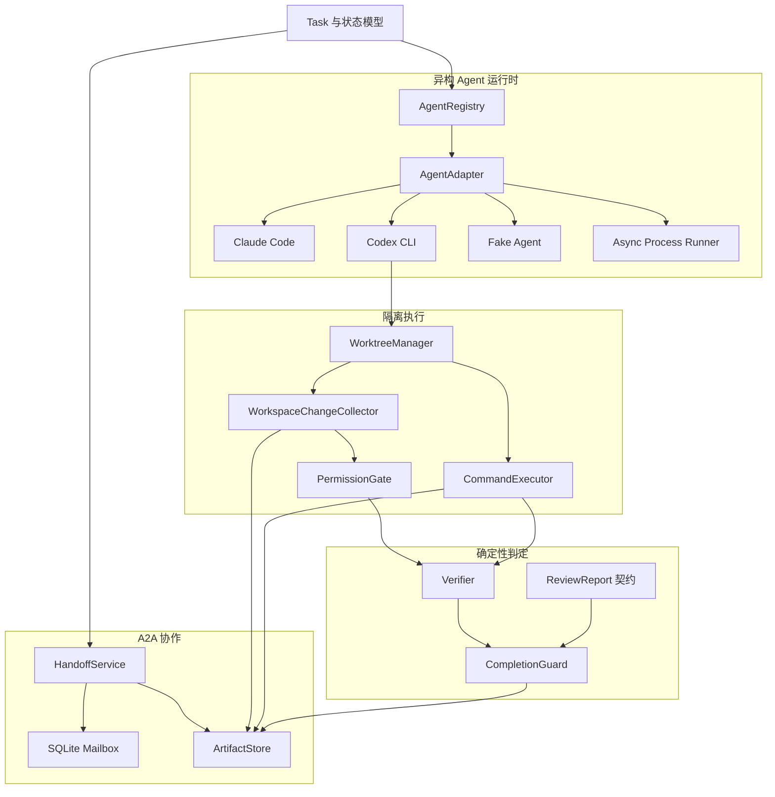

# CodeCrew｜异构编码 Agent 协作与可靠性评测平台

CodeCrew 是一个面向软件变更任务的独立开源项目。它把 Claude Code、Codex CLI
等不同模型组织成一支职责明确的编码团队，并使用确定性程序验证代码变更，而不是
接受 Agent 对“任务已经完成”的自然语言声明。

项目受 Clowder AI 的异构 Agent 团队思想启发，但从零独立实现，不复制其代码、
Prompt、UI、文档或品牌资源。CodeCrew 只聚焦代码开发场景，不建设通用聊天或陪伴平台。

> 当前状态：底层协作、隔离执行、验证、完成守卫、独立只读 Reviewer、最多两轮
> 返工闭环、TeamRoom、AgentTurnRunner、事件驱动 WorkflowController 和自动指令循环
> 已实现；跨进程恢复、完整 Trace 和产品入口仍在开发中。

## 目标工作流

```text
用户提交 Issue
      ↓
Claude Code Planner（只读分析与实施计划）
      ↓ 结构化 A2A Handoff
Codex CLI Implementer（独立 Git Worktree）
      ↓
确定性 Verifier（Diff、权限、编译、公开测试、隐藏测试）
      ↓
独立 Claude Code Reviewer（只读 Review）
      ├── 拒绝：返回 Codex 返工，最多两轮
      └── 批准：进入 CompletionGuard
                         ↓
              Patch、测试证据和任务报告
```

## 核心原则

- 不同角色使用独立 Agent 会话。
- Agent 之间传递结构化消息和 Artifact 引用，不复制完整聊天历史。
- Implementer 只在任务专属 Git Worktree 中修改代码。
- 大型 Plan、Diff、日志和报告存入内容寻址 ArtifactStore。
- 编译、测试、权限和完成条件由确定性代码判断。
- Reviewer 批准只是完成条件之一，不能单独决定成功。
- 所有任务和证据绑定 `task_id` 与 `trace_id`。
- 密钥只允许通过环境变量提供，不写入仓库。

## 当前已实现

### 任务与 Agent 运行时

- 软件任务状态模型和合法状态跳转检查
- Provider-neutral `AgentAdapter` 接口
- Claude Code 只读 Adapter
- Codex CLI 受限工作区 Adapter
- 可配置 `FakeAgentAdapter`
- 异步进程输出、超时、取消和退出码处理
- Agent Registry、能力匹配、权限模式与并发限制
- 可选的真实 CLI 集成测试

### A2A 协作与持久化

- 版本化 `HandoffEnvelope`
- `message_id`、`correlation_id`、`causation_id` 和幂等键
- SQLite Mailbox、FIFO 领取、ACK 和失败记录
- SHA-256 内容寻址 ArtifactStore
- 流式写入、原子落盘、物理去重和重启恢复
- Handoff 发送端与接收端 Artifact 完整性检查
- 任务、Trace、类型、哈希和实际 Blob 的一致性校验

### Worktree 与权限边界

- 任务专属 Git Worktree 和 `codecrew/<task_id>` 分支
- Worktree 幂等创建、重启恢复和安全清理
- 不影响用户原始工作区及其未提交修改
- 收集已提交、暂存、未暂存和未跟踪变更
- 支持新增、修改、删除、重命名、空文件和二进制文件
- 生成可通过 `git apply --binary` 重放的 Patch
- 文件允许目录、禁止目录和重命名双向检查
- Worktree 外部及仓库内禁止区域的符号链接检测
- 参数数组形式的命令白名单，不启用 Shell
- 工作目录、环境变量、超时和输出大小限制
- 默认不把父进程 API Key 等环境变量传给测试命令
- 成功、失败、拒绝、超时、取消和启动失败审计

### 确定性验证与完成守卫

- 最终有效 Diff 检查
- 执行前权限检查
- 静态检查或编译
- 公开测试与隐藏测试
- 测试结束后重新采集 Diff 和权限报告
- 禁止命令尝试检查
- 结构化 `VerificationReport`
- 结构化 Reviewer 结论和问题优先级契约
- 独立只读 Reviewer 会话、严格 JSON 输出解析和证据引用
- `CompletionGuard` 逐项重算完成条件
- Verification/Review 持久化报告绑定检查
- Artifact 归属、类型、SHA-256 和 Blob 完整性检查
- 结构化 `CompletionDecision` Artifact

### TeamRoom 基础通信

- 任务级聊天室、成员身份和 Agent/System/Human 角色模型
- 普通消息、问题回答、状态、Review、返工和系统事件类型
- 直接成员、角色和全房间接收者
- SQLite 消息持久化、逐接收者 ACK、回复线程和游标增量读取
- 消息幂等写入与并发写入保护
- `ConversationRouter` 身份校验和角色通信矩阵
- 系统消息防伪、回复因果约束及 Artifact 完整性校验
- 严格的 Agent 聊天动作 JSON 协议
- `AgentTurnRunner` 增量读取消息、启动/恢复会话并收集流式事件
- 动作全部路由成功后才 ACK，失败输入保留待重试
- 聊天事件驱动 Task 状态迁移并生成 Agent/Verifier/CompletionGuard 调度指令
- 工作流事件持久化去重，支持控制器重复消费和有限恢复
- `WorkflowDirectiveExecutor` 自动唤醒 Agent、运行 Verifier 和 CompletionGuard
- Verifier/CompletionGuard 以受保护的系统成员身份发布证据消息
- `WorkflowEventLoop` 连续消费新事件，并在完成、等待人工或安全上限时停止
- Planner/Reviewer 可内联输出小型结构化 JSON，由 TurnRunner 固化为 Artifact

## 完成守卫

任务只有同时满足以下条件，才允许标记为成功：

1. 存在有效 Git Patch；
2. 静态检查或编译通过；
3. 公开测试通过；
4. 隐藏测试通过；
5. 文件权限检查通过；
6. 没有禁止命令尝试；
7. Verifier 的全部必要检查通过；
8. Reviewer 明确批准；
9. 没有未解决的高优先级或严重问题；
10. 所有证据 Artifact 完整且与结构化报告一致。

Agent 的自然语言报告不能代替以上证据。

## 当前架构



## 尚未实现

以下内容仍属于开发计划，不能视为现有功能：

- Planner 输出解析与 Plan 服务
- 进程重启后恢复内存中的 VerificationReport 和运行队列
- 进程重启后的任务恢复
- Task、Trace 和 Event 的完整持久化
- SSE 实时事件和完整任务 API
- CLI 产品入口与任务控制台
- 12～15 条正式编码评测集
- 单 Agent 与多 Agent 对照实验
- Token 成本、平均时延和 P95 指标报告

当前 FastAPI 只提供基础健康检查，不代表完整产品 API 已经完成。

## 技术栈

- Python 3.11+
- FastAPI
- Pydantic v2
- asyncio
- SQLite / WAL
- Git Worktree
- pytest
- Ruff

Claude Code 和 Codex CLI 只在运行真实 Agent 或可选集成测试时需要安装。

## 快速开始

```bash
git clone <your-codecrew-repository-url>
cd CodeCrew

python3.11 -m venv .venv
.venv/bin/pip install -e '.[dev]'
cp .env.example .env
```

运行测试和静态检查：

```bash
.venv/bin/pytest
.venv/bin/ruff check .
```

当前测试基线：

```text
184 passed
2 skipped
```

两个默认跳过的测试会调用真实 Claude Code/Codex CLI，可能需要网络并消耗 Token。
显式运行方式：

```bash
CODECREW_RUN_CLI_INTEGRATION=1 .venv/bin/pytest -m integration
```

启动当前 FastAPI 健康检查服务：

```bash
.venv/bin/uvicorn app.main:app --reload
```

```bash
curl http://127.0.0.1:8000/health
```

## 配置

配置使用 `CODECREW_` 前缀环境变量。示例见 [.env.example](.env.example)。

主要配置包括：

| 环境变量 | 用途 |
| --- | --- |
| `CODECREW_DATABASE_URL` | SQLite 数据库地址 |
| `CODECREW_ARTIFACT_ROOT` | Artifact 文件目录 |
| `CODECREW_WORKTREE_ROOT` | 受管 Worktree 目录 |
| `CODECREW_MAX_REWORK_ROUNDS` | 最大返工轮数 |
| `CODECREW_AGENT_TIMEOUT_SECONDS` | Agent 默认超时 |
| `CODECREW_CLAUDE_CLI_PATH` | Claude Code 可执行文件 |
| `CODECREW_CODEX_CLI_PATH` | Codex CLI 可执行文件 |

不要在 `.env.example`、测试夹具或 Git 仓库中提交真实密钥。

## 项目结构

```text
app/
├── agents/          # Agent 接口、Registry 和 CLI Adapter
├── messaging/       # A2A Handoff、Mailbox 和消息完整性
├── orchestration/   # Task、Orchestrator、Reviewer 执行与返工调度
├── team/            # TeamRoom、聊天存储和受控 ConversationRouter
├── storage/         # SQLite 与 ArtifactStore
├── workspace/       # Worktree、Diff、权限和命令审计
├── verification/    # Verifier、Reviewer 契约和 CompletionGuard
├── trace/           # Trace/Event 持久化待实现
└── api/             # 完整任务 API 待实现

tests/               # 单元测试与可选 CLI 集成测试
evals/               # 后续评测任务、隐藏测试和结果
prompts/             # 后续版本化角色 Prompt
docs/                # 架构和 Adapter 文档
```

## 安全边界说明

当前实现提供 Worktree 隔离、路径权限检查、命令白名单、环境过滤和执行审计，
但它还不是操作系统级沙箱。被允许执行的编译器或测试进程仍是本机进程。
在运行不可信仓库之前，应使用额外的容器、虚拟机或操作系统沙箱；Docker 隔离计划作为后续可选能力。

## 开发路线

- [x] 阶段一：项目骨架、配置和任务状态模型
- [x] 阶段二：AgentAdapter、Claude Code、Codex CLI 和 Fake Agent
- [x] 阶段三：A2A Handoff、SQLite Mailbox 和 ArtifactStore
- [x] 阶段四：Git Worktree、变更收集、权限和命令审计
- [x] 阶段五之一：确定性 Verifier
- [x] 阶段五之二：CompletionGuard 与 Reviewer 数据契约
- [x] 阶段五之三：Orchestrator 单轮主状态机
- [x] 阶段五之四：独立 Reviewer 执行与两轮返工循环
- [x] 阶段五点五之一：TeamRoom 通信模型、SQLite Store 和 ConversationRouter
- [x] 阶段五点五之二：Agent 聊天动作协议与 AgentTurnRunner
- [x] 阶段五点五之三：事件驱动 WorkflowController 核心归约器
- [x] 阶段五点五之四：指令执行器、系统 Bot 与自动事件循环
- [ ] 阶段五点五之五：Planner 澄清、Reviewer 返工与对话预算
- [ ] 阶段六：Trace、SSE、任务 API、CLI 和端到端 MVP
- [ ] 阶段七：多语言编码任务评测集
- [ ] 阶段八：单 Agent / 多 Agent 对照实验与指标报告

## 文档

- [MVP 架构与边界](docs/architecture.md)
- [Agent Adapter 生命周期与安全说明](docs/agent-adapters.md)
- [TeamRoom 与 Agent 对话执行](docs/team-rooms.md)

## License

Apache-2.0
