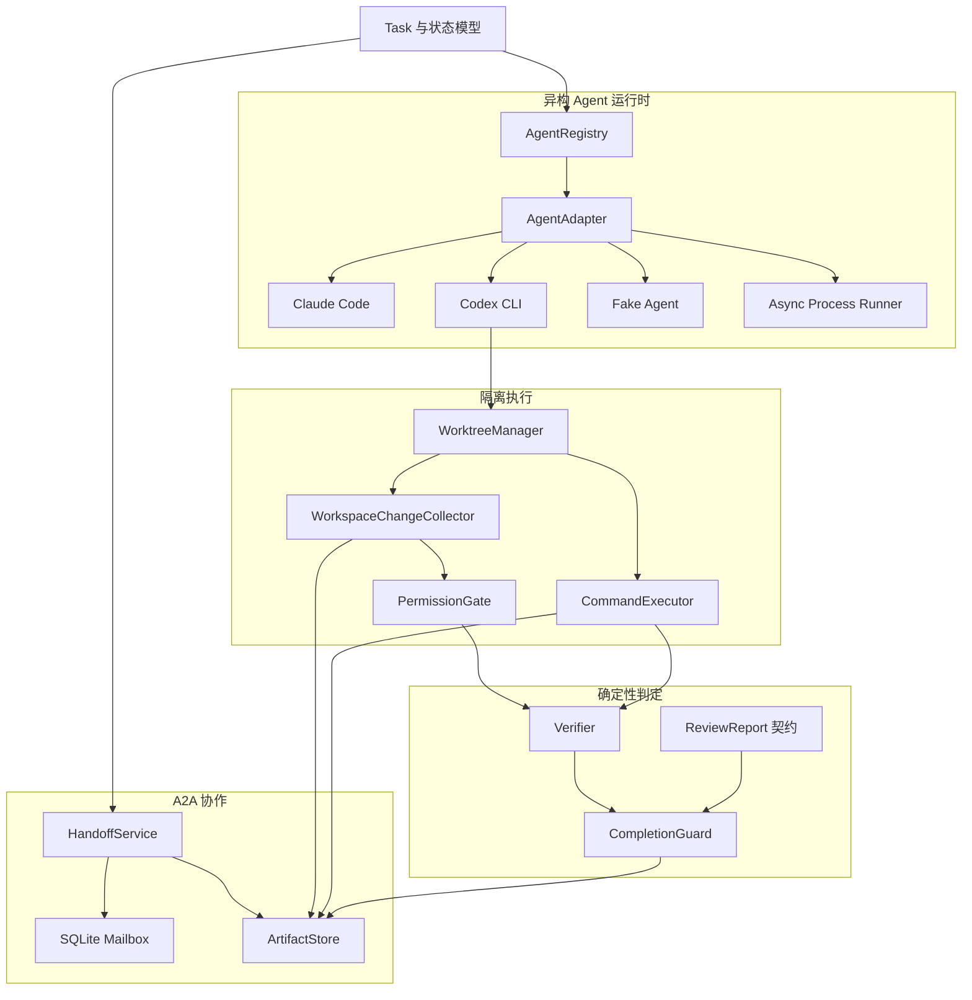

# CodeCrew｜异构编码 Agent 协作与可靠性评测平台

CodeCrew 是一个面向软件变更任务的独立开源项目。它把 Codex CLI、Kimi Code CLI、
Claude Code 等不同 Agent 执行环境组织成一支职责明确的编码团队，并使用确定性程序
验证代码变更，而不是接受 Agent 对“任务已经完成”的自然语言声明。

项目受 Clowder AI 的异构 Agent 团队思想启发，但从零独立实现，不复制其代码、
Prompt、UI、文档或品牌资源。CodeCrew 只聚焦代码开发场景，不建设通用聊天或陪伴平台。

> 当前状态：底层协作、隔离执行、验证、完成守卫、独立只读 Reviewer、最多两轮
> 返工闭环、TeamRoom、AgentTurnRunner、事件驱动 WorkflowController 和自动指令循环
> 已实现；任务/运行上下文持久化、统一 Trace、验证证据恢复、Workflow Recovery
> Coordinator 和跨进程崩溃恢复测试已完成。阶段七已打通任务 API、SSE、
> 显式配置的本地 CLI 服务入口与 Fake Agent 端到端验证；三位成员的人格资料与
> 团队原则已接入 Agent 回合；本地任务工作台已可创建和取消任务。UI 人工干预、
> 三真实 Agent 的受控成功夹具已通过；真实返工/预算、UI 真实团队验收和正式评测集
> 尚未完成。最新验证状态见
> [项目状态与后续路线](docs/project-status.md)。

## 目标工作流

```text
用户提交 Issue（API 或本地 UI 创建表单）
      ↓
Planner（白金：Codex CLI，只读分析与实施计划）
      ↓ 结构化 A2A Handoff
Implementer（月见：Kimi Code CLI，独立 Git Worktree）
      ↓
确定性 Verifier（Diff、权限、编译、公开测试、隐藏测试）
      ↓
独立 Reviewer（鲸鲸：Claude Code 接 DeepSeek Flash，只读 Review）
      ├── 拒绝：返回 Implementer 返工，最多两轮
      └── 批准：进入 CompletionGuard
                         ↓
              Patch、测试证据和任务报告
```

上图是目标团队配置；这套组合的受控五回合成功夹具已通过，但不等于任意任务或 UI
端到端验收。当前服务示例默认
使用 Codex CLI Planner / Implementer 与 Claude Code Reviewer；Kimi 与 DeepSeek
需要分别显式选择；DeepSeek Reviewer 的独立在线冒烟已由用户本机运行通过。

## 核心原则

- 不同角色使用独立 Agent 会话。
- Agent 之间传递结构化消息和 Artifact 引用，不复制完整聊天历史。
- Implementer 只在任务专属 Git Worktree 中修改代码。
- 大型 Plan、Diff、日志和报告存入内容寻址 ArtifactStore。
- 编译、测试、权限和完成条件由确定性代码判断。
- Reviewer 批准只是完成条件之一，不能单独决定成功。
- 所有任务和证据绑定 `task_id` 与 `trace_id`。
- 密钥只允许通过环境变量提供，不写入仓库。

## 当前已实现

### 任务与 Agent 运行时

- 软件任务状态模型和合法状态跳转检查
- SQLite `TaskRepository` 持久化完整任务快照、状态、返工轮次和 metadata
- 单调递增 revision 与乐观锁，阻止恢复进程或并发写入静默覆盖新状态
- `RuntimeContextRepository` 持久化 Room、Worktree、验证计划和角色 Agent 绑定
- 各角色原生 Session ID 可跨进程恢复，并由执行器传给 Adapter 继续会话
- Provider-neutral `AgentAdapter` 接口
- Claude Code 只读 Adapter
- Codex CLI 受限工作区 Adapter
- 可配置 `FakeAgentAdapter`
- 异步进程输出、超时、取消和退出码处理
- Agent Registry、能力匹配、权限模式与并发限制
- 可选的真实 CLI 集成测试

### A2A 协作与持久化

- 版本化 `HandoffEnvelope`
- `message_id`、`correlation_id`、`causation_id` 和幂等键
- SQLite Mailbox、FIFO 领取、ACK 和失败记录
- SHA-256 内容寻址 ArtifactStore
- 本地生成的引用展示摘要限长并标记省略，完整证据和原始回复不截断
- 流式写入、原子落盘、物理去重和重启恢复
- Handoff 发送端与接收端 Artifact 完整性检查
- 任务、Trace、类型、哈希和实际 Blob 的一致性校验

### Worktree 与权限边界

- 任务专属 Git Worktree 和 `codecrew/<task_id>` 分支
- Worktree 幂等创建、重启恢复和安全清理
- 不影响用户原始工作区及其未提交修改
- 收集已提交、暂存、未暂存和未跟踪变更
- 支持新增、修改、删除、重命名、空文件和二进制文件
- 生成可通过 `git apply --binary` 重放的 Patch
- 文件允许目录、禁止目录和重命名双向检查
- Worktree 外部及仓库内禁止区域的符号链接检测
- 参数数组形式的命令白名单，不启用 Shell
- 工作目录、环境变量、超时和输出大小限制
- 默认不把父进程 API Key 等环境变量传给测试命令
- 成功、失败、拒绝、超时、取消和启动失败审计

### 确定性验证与完成守卫

- 最终有效 Diff 检查
- 执行前权限检查
- 静态检查或编译
- 公开测试与隐藏测试
- 测试结束后重新采集 Diff 和权限报告
- 禁止命令尝试检查
- 结构化 `VerificationReport`
- 结构化 Reviewer 结论和问题优先级契约
- 独立只读 Reviewer 会话、严格 JSON 输出解析和证据引用
- `CompletionGuard` 逐项重算完成条件
- Verification/Review 持久化报告绑定检查
- Artifact 归属、类型、SHA-256 和 Blob 完整性检查
- 结构化 `CompletionDecision` Artifact

### TeamRoom 基础通信

- 任务级聊天室、成员身份和 Agent/System/Human 角色模型
- 普通消息、问题回答、状态、Review、返工和系统事件类型
- 直接成员、角色和全房间接收者
- SQLite 消息持久化、逐接收者 ACK、回复线程和游标增量读取
- 消息幂等写入与并发写入保护
- `ConversationRouter` 身份校验和角色通信矩阵
- 系统消息防伪、回复因果约束及 Artifact 完整性校验
- 严格的 Agent 聊天动作 JSON 协议
- `AgentTurnRunner` 增量读取消息、启动/恢复会话并收集流式事件
- 白金、月见、鲸鲸三层人格资料、团队关系原则与角色回合 prompt 注入
- 新任务 TeamRoom 使用人格展示名；`@称呼` 暂不自动路由，仍按结构化收件人派发
- 动作全部路由成功后才 ACK，失败输入保留待重试
- 聊天事件驱动 Task 状态迁移并生成 Agent/Verifier/CompletionGuard 调度指令
- 工作流事件持久化去重，支持控制器重复消费和有限恢复
- `WorkflowDirectiveExecutor` 自动唤醒 Agent、运行 Verifier 和 CompletionGuard
- Verifier/CompletionGuard 以受保护的系统成员身份发布证据消息
- `WorkflowEventLoop` 连续消费新事件，并在完成、等待人工或安全上限时停止
- Planner/Reviewer 可内联输出小型结构化 JSON，由 TurnRunner 固化为 Artifact
- Implementer 可向 Planner 发起结构化澄清，Planner 通过回复线程回答并发布修订 Plan
- Plan 以不可变版本链持久化，记录版本号、被替代 Artifact 和本次解决的问题
- Reviewer 拒绝时必须发布结构化 Review Artifact，Implementer 按问题清单返工后重新验证
- Review 问题通过稳定 `issue_id` 跨轮追踪，批准前必须保留并更新历史未解决问题
- `ConversationBudgetGuard` 持久化 Agent Turn、Token 和耗时，并限制消息总量
- 重复发言或连续提问没有产生工作流进展时，确定性暂停并转人工处理
- 统一 `TraceStore` 记录消息、状态迁移、Agent Turn、验证、审批和预算事件
- Trace 采用追加写入、幂等键、因果关联和游标查询，可用于回放与后续 SSE

## 完成守卫

任务只有同时满足以下条件，才允许标记为成功：

1. 存在有效 Git Patch；
2. 静态检查或编译通过；
3. 公开测试通过；
4. 隐藏测试通过；
5. 文件权限检查通过；
6. 没有禁止命令尝试；
7. Verifier 的全部必要检查通过；
8. Reviewer 明确批准；
9. 没有未解决的高优先级或严重问题；
10. 所有证据 Artifact 完整且与结构化报告一致。

Agent 的自然语言报告不能代替以上证据。

## 当前架构



## 尚未实现

以下内容仍属于开发计划，不能视为现有功能：

- 多 worker 分布式派发与跨进程租约
- Trace 与领域记录不一致时的自动回填
- 三真实模型完整任务闭环及实际远端模型版本确认
- UI 人工对话干预；远程使用所需的 API 身份认证
- 真正对 Agent 不可见的隐藏测试隔离环境
- 12～15 条正式编码评测集
- 单 Agent 与多 Agent 对照实验
- Token 成本、平均时延和 P95 指标报告

默认 `app.main:app` 仍未配置真实 Agent 和验证策略，任务路由返回 503；
需使用下方显式配置的本地 CLI 入口。当前不应将 API 暴露到公网或运行不可信仓库。

## 技术栈

- Python 3.11+
- FastAPI
- Pydantic v2
- asyncio
- SQLite / WAL
- Git Worktree
- pytest
- Ruff

Claude Code 和 Codex CLI 只在运行真实 Agent 或可选集成测试时需要安装。

## 快速开始

```bash
git clone <your-codecrew-repository-url>
cd CodeCrew

python3.11 -m venv .venv
.venv/bin/pip install -e '.[dev]'
cp .env.example .env
```

运行测试和静态检查：

```bash
.venv/bin/pytest
.venv/bin/ruff check .
```

需要确保当前已有的在线测试开关全部关闭时，可使用统一离线入口：

```bash
.venv/bin/python scripts/check_offline.py
```

它运行全部 pytest 与 Ruff，并从子进程环境移除已知模型密钥；不修改父终端环境。
这不是网络沙箱，macOS Seatbelt 用例仍需在允许启动 Seatbelt 的环境验证。

真实 CLI / Kimi 在线测试默认跳过；启用后可能需要网络并消耗 Token 或会员额度。
Claude Code/Codex CLI 集成测试的显式运行方式：

```bash
CODECREW_RUN_CLI_INTEGRATION=1 .venv/bin/pytest -m integration
```

仅启动默认 FastAPI 健康检查服务（任务路由返回 503）：

```bash
.venv/bin/uvicorn app.main:app --reload
```

```bash
curl http://127.0.0.1:8000/health
```

本地任务工作台位于 `http://127.0.0.1:8000/ui/`。默认服务会在页面提示任务服务未配置，
不能创建真实任务。若只想在浏览器验证创建与取消交互，可另开终端运行不调用模型的临时冒烟
服务（使用开发依赖，地址为 `http://127.0.0.1:8765/ui/`）：

```bash
.venv/bin/python tests/manual_ui_smoke.py
```

该脚本会打印一次性 Git 仓库路径；将它填入页面后创建并取消测试任务，退出服务即清理仓库。
它只验证 UI/API 控制链路，不代表真实 Agent 任务成功。

使用显式策略启动可执行任务的本地单 worker API：

```bash
.venv/bin/python -m app.cli serve --config examples/server-config.python.json --port 8000
```

安装项目后也可使用 `codecrew serve ...`。该入口仅绑定 `127.0.0.1`，示例默认接线为
Codex CLI Planner / Implementer、Claude Code Reviewer。Planner 可改用 Claude Code；
Reviewer 可显式选择 DeepSeek 变体；Implementer 可显式选择已通过单任务真实冒烟的 Kimi
Code CLI（仅限 macOS，并需在 shell 环境提供新的 Kimi Code **会员**密钥作为
`KIMI_MODEL_API_KEY`）。此路径使用会员 API 的 `kimi-for-coding` 模型别名，
不能据此宣称实际后端固定为 K3。启动前须安装并配置
所选 CLI，且根据目标仓库修改示例的验证命令、
允许目录及 `CODECREW_WORKTREE_ROOT`；Worktree 根目录必须在目标仓库外。
可选的单次 Kimi 真实冒烟命令和安全限制见
[真实模型接入说明](docs/real-model-integration.md)。
示例中的 `tests/hidden` **只是配置占位路径，不是保密的隐藏测试**。真正对 Agent
不可见的隐藏测试隔离环境尚未实现，不能把示例配置用于正式可靠性评测。

白金/Codex、月见/Kimi、鲸鲸/DeepSeek 的显式团队示例见
[`examples/server-config.codecrew-team.python.json`](examples/server-config.codecrew-team.python.json)。
它已通过聊天运行时的离线协议预检，尚未通过三真实 Agent 端到端验收。
已实现 Kimi 对本轮 Artifact 的逐文件只读授权，并通过 Plan → 澄清 → Plan v2 → 修改的
离线联调；用户本机已通过 4 回合真实 Planner → Implementer 交接与 Verifier 验收。
5 回合 Planner → Implementer → Verifier → 独立 Reviewer → CompletionGuard
用例已实现并通过离线模拟回归，三模型在线成功路径仍待显式启用验收。
5 个子步骤、预检命令及权限边界见[三 Agent 联调说明](docs/three-agent-integration.md)。
聊天室已加入受控输出归一化：允许外围说明中的唯一 JSON 代码块，或说明后从新行
开始、后面仅含空白的唯一完整尾部 JSON 对象；歧义回复仍拒绝，
原文留存到诊断 Artifact/Trace；动作权限和完成条件不变，也不增加自动模型重试。

## 配置

配置使用 `CODECREW_` 前缀环境变量。示例见 [.env.example](.env.example)。

主要配置包括：

| 环境变量 | 用途 |
| --- | --- |
| `CODECREW_DATABASE_URL` | SQLite 数据库地址 |
| `CODECREW_ARTIFACT_ROOT` | Artifact 文件目录 |
| `CODECREW_WORKTREE_ROOT` | 受管 Worktree 目录 |
| `CODECREW_MAX_REWORK_ROUNDS` | 最大返工轮数 |
| `CODECREW_AGENT_TIMEOUT_SECONDS` | Agent 默认超时 |
| `CODECREW_PLANNER_TIMEOUT_SECONDS` | 可选 Planner 专用超时，1～900 秒；未设置时继承执行器默认值 |
| `CODECREW_CLAUDE_CLI_PATH` | Claude Code 可执行文件 |
| `CODECREW_CODEX_CLI_PATH` | Codex CLI 可执行文件 |

不要在 `.env.example`、测试夹具或 Git 仓库中提交真实密钥。

## 项目结构

```text
app/
├── agents/          # Agent 接口、Registry 和 CLI Adapter
├── messaging/       # A2A Handoff、Mailbox 和消息完整性
├── orchestration/   # Task、Orchestrator、Reviewer 执行与返工调度
├── team/            # TeamRoom、聊天存储和受控 ConversationRouter
├── storage/         # SQLite 与 ArtifactStore
├── workspace/       # Worktree、Diff、权限和命令审计
├── verification/    # Verifier、Reviewer 契约和 CompletionGuard
├── trace/           # Trace/Event 持久化与回放
├── api/             # 任务 API、持久化服务与 SSE
└── cli.py           # 显式配置的本地单 worker 启动入口

tests/               # 单元、Fake Agent API 端到端及可选真实 CLI 集成测试
examples/            # 本地服务策略配置示例
evals/               # 后续评测任务、隐藏测试和结果
prompts/             # 后续版本化角色 Prompt
docs/                # 架构和 Adapter 文档
```

## 安全边界说明

当前实现提供 Worktree 隔离、路径权限检查、命令白名单、环境过滤和执行审计，
但它还不是操作系统级沙箱。被允许执行的编译器或测试进程仍是本机进程。
在运行不可信仓库之前，应使用额外的容器、虚拟机或操作系统沙箱；Docker 隔离计划作为后续可选能力。

## 开发路线

- [x] 阶段一：项目骨架、配置和任务状态模型
- [x] 阶段二：AgentAdapter、Claude Code、Codex CLI 和 Fake Agent
- [x] 阶段三：A2A Handoff、SQLite Mailbox 和 ArtifactStore
- [x] 阶段四：Git Worktree、变更收集、权限和命令审计
- [x] 阶段五之一：确定性 Verifier
- [x] 阶段五之二：CompletionGuard 与 Reviewer 数据契约
- [x] 阶段五之三：Orchestrator 单轮主状态机
- [x] 阶段五之四：独立 Reviewer 执行与两轮返工循环
- [x] 阶段五点五之一：TeamRoom 通信模型、SQLite Store 和 ConversationRouter
- [x] 阶段五点五之二：Agent 聊天动作协议与 AgentTurnRunner
- [x] 阶段五点五之三：事件驱动 WorkflowController 核心归约器
- [x] 阶段五点五之四：指令执行器、系统 Bot 与自动事件循环
- [x] 阶段五点五之五 A：Planner ↔ Implementer 澄清与 Plan 版本管理
- [x] 阶段五点五之五 B：Reviewer ↔ Implementer 对话式返工
- [x] 阶段五点五之五 C：对话预算与死循环保护
- [x] 阶段六之一：TaskRepository 与乐观锁
- [x] 阶段六之二：运行上下文持久化
- [x] 阶段六之三：TraceStore 与统一事件记录
- [x] 阶段六之四：验证证据恢复
- [x] 阶段六之五：Workflow Recovery Coordinator
- [x] 阶段六之六：崩溃恢复集成测试
- [x] 阶段七之一：任务 API 请求/响应契约、版本化路由与错误格式
- [x] 阶段七之二：可注入的持久化任务服务与本进程工作流启动
- [x] 阶段七之三：显式运行时装配、应用启动恢复与本进程任务取消
- [x] 阶段七之四：基于 TraceStore 的任务 SSE 事件流与断线续接
- [x] 阶段七之五：Fake Agent 端到端任务 API 测试与本地 CLI 入口
- [x] 阶段八：任务列表、聊天室和证据查看前端（本地只读 MVP）
- [x] 阶段八之一：任务详情只读 API（Room、消息分页、Plan 版本和任务归属校验的证据预览）
- [x] 阶段八之二：本地只读任务工作台（列表、团队对话、Plan 版本、证据预览）
- [x] 阶段八之三：选中任务的 SSE 实时更新与断线续接
- [x] 阶段八之四：页面/API/SSE 联调、异常状态处理与界面收尾
- [x] 真实模型接入之一：核对 Kimi Code 会员 API / DeepSeek Flash 官方接口、CLI 与安全边界
- [x] 真实模型接入之二 A：独立 DeepSeek Reviewer Adapter、配置绑定与环境隔离（离线测试）
- [x] 真实模型接入之二 B1：Kimi CLI 受限工具配置与 macOS 写入沙箱（系统级离线测试）
- [x] 真实模型接入之二 B2a：Kimi Implementer Adapter、受限启动路径和离线会话测试
- [x] 真实模型接入之二 B2b-1：Kimi CLI 会员模型单任务真实冒烟（文件写入、变更范围和工具清单）
- [x] 真实模型接入之二 B2b-2a：小型 Bug 修复夹具、公开/额外断言、Verifier 与假完成离线测试
- [x] 真实模型接入之二 B2b-2b：Kimi→Verifier 真实小型编码任务（用户本机运行）
- [x] UI 任务操作之一：创建表单、创建后选中与最新任务优先列表
- [x] UI 任务操作之二：取消任务与冲突处理
- [x] UI 任务操作之三：页面/API 创建与取消联调、离线回归和浏览器冒烟
- [x] DeepSeek Reviewer 真实冒烟之一：本机 CLI 选项、只读工具装配和密钥隔离预检（无模型调用）
- [x] DeepSeek Reviewer 真实冒烟之二：真实 Diff/Verifier 证据夹具、模拟 CLI 双会话与错误失败关闭（无模型调用）
- [x] DeepSeek Reviewer 真实冒烟之三：用户本机在线用例通过（有效证据批准、无 Diff 拒绝、工具/文件状态检查）
- [x] DeepSeek Reviewer 真实冒烟之四：统一离线验收入口、结果来源与限制收口、三 Agent 联调条件
- [ ] 真实模型接入之二 B2b-2c：禁止命令主动拒绝验证
- [ ] 阶段九：多语言编码任务评测集
- [ ] 阶段十：单 Agent / 多 Agent 对照实验与指标报告
- [ ] 阶段十一：演示样例、部署文档和简历材料

## 文档

- [MVP 架构与边界](docs/architecture.md)
- [Agent Adapter 生命周期与安全说明](docs/agent-adapters.md)
- [TeamRoom 与 Agent 对话执行](docs/team-rooms.md)
- [验证证据与任务恢复](docs/evidence-recovery.md)
- [统一 Trace 与事件回放](docs/tracing.md)
- [任务 API 契约](docs/task-api.md)
- [本地 UI 任务操作契约（创建/取消已实现）](docs/ui-task-controls.md)
- [真实模型接入决策与验收](docs/real-model-integration.md)
- [DeepSeek Reviewer 分步冒烟](docs/deepseek-reviewer-smoke.md)
- [团队人格系统](docs/personas.md)
- [项目状态与后续路线](docs/project-status.md)

## License

Apache-2.0
