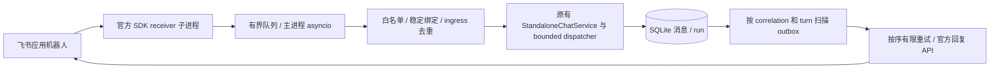
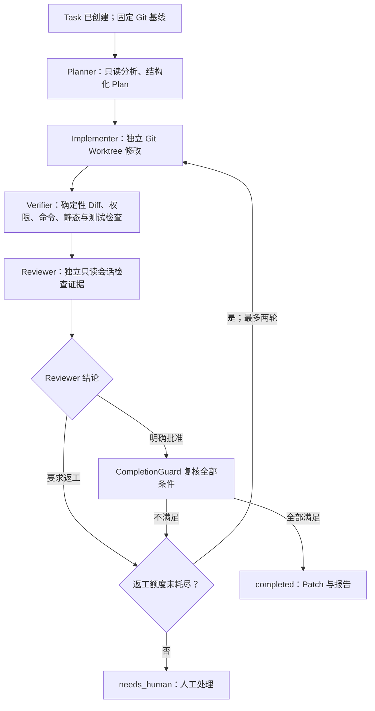

# CodeCrew 当前架构（简历演示版）

更新于 2026-10-04。当前产品有两条独立入口：**无 Git 仓库的只读聊天室**，以及
**Human 显式授权后才启动的受控编码任务**。下图描述已实现的本地单进程路径，
不是多 worker、远程 SaaS 或通用 Agent 平台的设计承诺。

## 系统边界

```mermaid
flowchart TB
    Human[Human] --> UI[浏览器 /ui/chat/]

    subgraph Chat[独立聊天室：默认只读]
        API[Chat API 与 SSE 通知] --> Service[StandaloneChatService]
        Service --> Store[(SQLite：房间、消息、回合)]
        API -->|普通消息| Dispatcher[StandaloneChatDispatcher]
        API -->|显式有界批次| Bounded[BoundedDiscussionDispatcher]
        Dispatcher --> Runtime[独立只读 Agent 会话]
        Bounded --> Runtime
        Bounded --> Store
        Runtime --> CLIs[Codex / Kimi / Claude 接 DeepSeek；或 Fake]
        Store --> API
    end

    UI -->|普通消息、@提及、回复| API
    UI -->|勾选有界模式；启动/暂停/继续/取消| API
    UI -->|Human 单独预检并确认| Auth[ChatCodingAuthorizationService]
    Auth -->|核对同房间 Human 消息| Store
    Auth -->|重查 Git 基线与写入范围；单次授权| TaskService[TaskService]
    TaskService --> TaskFlow[受控编码工作流]
```

普通聊天只保存消息并调度只读接话，不需要仓库路径，也不创建 Task/Worktree。
`@月见` 或 Agent 间 `handoff_to` 都**不是写权限**。聊天室 Agent 各用独立会话；
调度器只传有界同讨论消息与显式选取的背景，不复制完整聊天历史。SQLite 保存
消息、投递和回合状态；SSE 只提示页面重新读取持久化快照，不是逐 Token 输出。
有界批次另以 SQLite 记录 FIFO 邀请、预算和人工控制状态；暂停在安全回合边界
生效，继续保留原预算，取消不能确认时保守中断。P6.5 已在独立聊天室提供
默认关闭的网页入口和状态控件；真实模型连续接话验收仍待 P6.6。

跨边界时，[预检](chat-to-code-authorization.md)先确认消息来自 Human、仓库和
Git HEAD 合法、路径范围可用；**预检不执行任务**。Human 勾选确认并提交
幂等键后，服务端再次检查基线和权限策略，再占用一次性授权记录并创建 Task。
未知结果的 `pending` 占用不会自动重派。只有显式装配了任务运行时的本地服务
才提供这条入口；`chat-demo` 和 `chat-serve` 不提供编码授权。

## 飞书只读入口

飞书是独立聊天室的可选入口，只有 `chat-serve --feishu` 显式装配：



子进程只收事件，不调度模型或访问数据库。父服务保持单实例；SDK 子进程用于确保阻塞长连接可停止，不提供分布式调度。外部 Human 来源是可选消息字段，UI 和有界上下文区分真实发言者，preflight/authorize 拒绝外部来源。外部消息不能创建 Task/Worktree。SQLite migration 19 保存绑定、ingress、事件别名和 outbox；重启只补投递，不补跑不确定模型。真实飞书烟雾测试未执行；[实现细节](feishu-integration-development.md)说明 ACK、重复投递和有限重试的边界。

## 授权后的编码状态流



任务级 [TeamRoom](team-rooms.md) 持久化结构化 Agent 消息、ACK、Plan 版本与
证据引用。[WorkflowController](../app/team/controller.py) 把消息事件归约为合法
状态迁移和下一步指令；执行器再唤醒角色、运行 Verifier 或 CompletionGuard。
Planner、Implementer、Reviewer 使用彼此独立的会话。实现只在 Task 专属
Worktree 中进行；Worktree 在建 Task 时按确认的 Git 基线创建。Reviewer 只读，
不能修改代码或替代确定性验证。

Verifier 依据服务端配置运行静态/编译、公开测试、占位隐藏断言、变更目录与
命令审计；变更和结果形成 Artifact。CompletionGuard 同时要求有效 Diff、
必要检查通过、Reviewer 明确批准、没有未解决高优先级问题以及证据完整。
Agent 的自然语言“完成了”不会让 Task 进入 `completed`。当前示例的“隐藏测试”
对本机操作者不保密，不能当作正式评测隔离。

## 模块与数据归属

| 边界 | 主要实现 | 持久化或产出 |
| --- | --- | --- |
| 独立聊天 | [`app/chat/`](../app/chat/)、[`app/api/chats.py`](../app/api/chats.py) | SQLite 房间、消息、投递、回合；SSE 失效通知 |
| 授权桥接 | [`app/chat/coding_intent.py`](../app/chat/coding_intent.py)、[`app/chat/coding_authorization.py`](../app/chat/coding_authorization.py) | 预检快照、单次授权记录、Task ID |
| Agent 与任务控制 | [`app/agents/`](../app/agents/)、[`app/team/`](../app/team/)、[`app/orchestration/`](../app/orchestration/) | 独立会话、任务状态、TeamRoom 消息与返工轮次 |
| 隔离与判定 | [`app/workspace/`](../app/workspace/)、[`app/verification/`](../app/verification/) | Worktree、Patch、检查报告、完成决策 |
| 证据与追踪 | [`app/storage/`](../app/storage/)、[`app/trace/`](../app/trace/) | SQLite 快照/事件、内容寻址 Artifact、`trace_id` |

各角色通过 `AgentAdapter` 接口接入 CLI 或 Fake；结构化 A2A 消息只携带必要字段
和 Artifact 引用。Task 与运行上下文使用持久化快照及修订号，Trace 记录可关联
任务事件；这不是跨进程分布式调度保证。启动模式和已验证范围见
[README](../README.md)与[当前路线](portfolio-roadmap.md)。

## 验收范围与未完成项

- Fake 浏览器已走通“聊天 → Human 预检/授权 → 编码 → Patch”；真实三模型完成过
  **一次临时小修复的 HTTP 自动验收**，不等于任意任务成功率或浏览器手动代码演示。
- 独立聊天室真实三模型最小对话已验收；长聊背景引用只通过 Fake 与真实 Planner
  的限定场景，未声称通用长期记忆。
- 当前仅建议可信本机运行；没有公网身份认证、通用不可信仓库 OS 级沙箱、
  对 Agent 真正保密的隐藏测试、正式评测集或多 worker 分布式派发。

逐次验收事实和后续步骤见[项目状态](project-status.md)。
