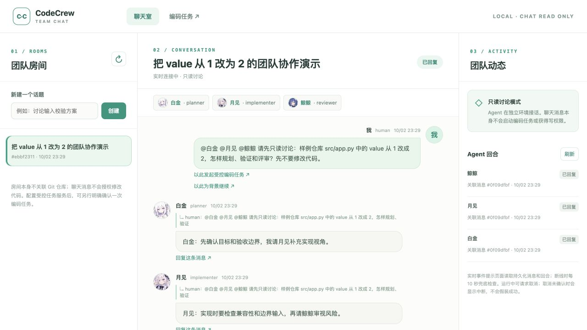
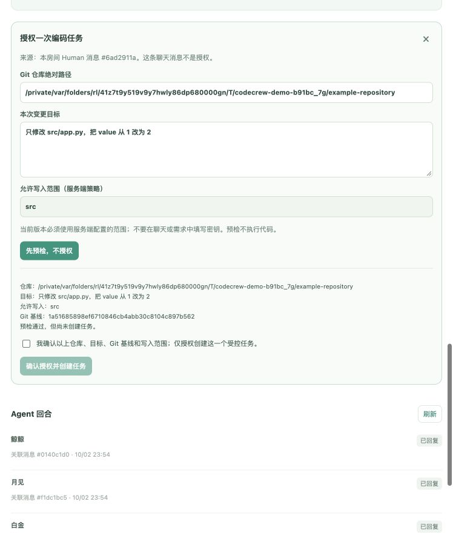
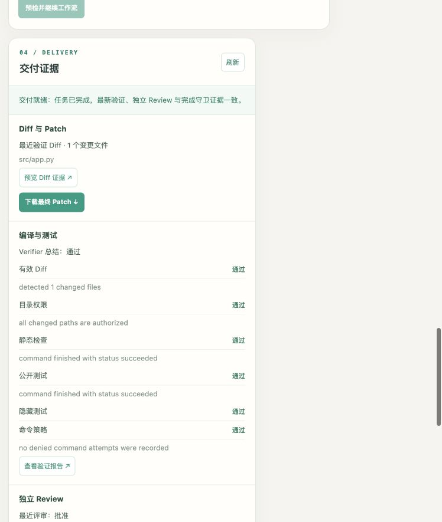
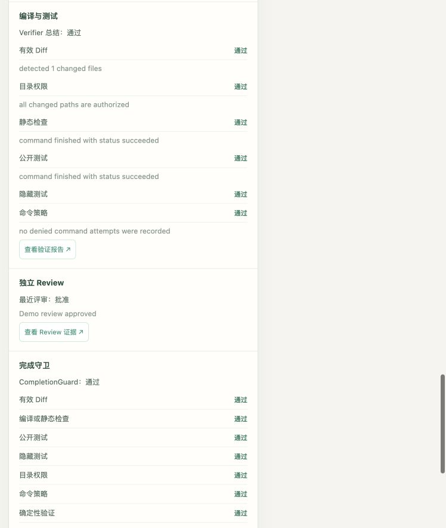

# CodeCrew 本地演示指南

这是一份可照着操作的公开项目演示，不需要把任何模型密钥交给观众。推荐先演示
**独立只读聊天室**，再按需演示 **Human 授权的一次代码修改**。两段都使用 Fake
Agent，不调用真实模型；它们是不同的服务模式，切换时先停止前一个服务。

## 准备与模式选择

在项目根目录使用 Python 3.11+ 和 Git：

```bash
python3.11 -m venv .venv
.venv/bin/pip install -e '.[dev]'
```

已经安装依赖时，不必重复创建虚拟环境。所有网页服务仅监听本机
`127.0.0.1`。如果 8000 端口被占用，将下文命令中的 `--port 8000` 改为
`--port 8768`，浏览器地址也改用 8768。

| 模式 | 启动命令 | 会调用模型吗 | 数据与用途 |
| --- | --- | --- | --- |
| 只读聊天 | `.venv/bin/python -m app.cli chat-demo --port 8000` | 不会 | 房间和消息存入本地 `./codecrew.db`；可反复查看 |
| 聊天后授权编码 | `.venv/bin/python -m app.cli demo-serve --port 8000` | 不会 | 生成临时示例仓库；退出服务即清理仓库、Worktree、数据库与证据 |
| 真实只读聊天 | `.venv/bin/python -m app.cli chat-serve --port 8000` | 会 | 需本机 CLI、凭据和 macOS Kimi Seatbelt；见[在线验收](standalone-chat-live.md) |
| 真实临时小修复 | `.venv/bin/python -m app.cli live-demo --port 8000` | 会 | 有调用成本与环境要求；单次 HTTP 验收和浏览器入口的区别见[验收指南](real-chat-to-code-acceptance.md) |

### A. 无密钥只读聊天（约 2 分钟）

1. 运行 `chat-demo`，打开 `http://127.0.0.1:8000/ui/chat/`。左侧创建房间，
   例如“输入校验讨论”；**不需要填写 Git 仓库路径**。如果已有旧房间，那是
   `chat-demo` 的持久化数据，直接另建一个房间即可。
2. 发送：

   ```text
   @白金 请和月见、鲸鲸讨论给 Python 函数增加输入校验时的兼容性和测试边界；只讨论，不修改文件。
   ```

3. 中间时间线应依次出现白金、月见、鲸鲸的固定 Fake 回复；右侧显示各 Agent
   回合状态。可以点击“回复这条消息”继续对话，也可以刷新页面，确认消息仍在。
   **预期不会出现代码 Diff、编码任务或写入授权**。

这段演示验证的是路由、Agent 间接话、消息持久化与界面反馈。Fake 回复是固定
剧本，不代表三种真实模型对该问题的推理质量；SSE 用来提示页面读取已持久化的
消息和状态，不是模型逐 Token 输出。

### B. 无密钥受控编码（约 3～5 分钟）

先在运行 `chat-demo` 的终端按 `Ctrl+C`，再运行：

```bash
.venv/bin/python -m app.cli demo-serve --port 8000
```

终端会打印本次**临时示例 Git 仓库的绝对路径**。浏览器打开
`http://127.0.0.1:8000/ui/chat/`；这是一个新服务，不会继承 A 段的房间。

1. 新建房间“演示小修复”，发送
   `@白金 请讨论只修改 src/app.py，把 value 从 1 改为 2`。观察三位 Fake Agent
   在只读聊天中接话。此刻聊天消息没有授予写权限。
2. 在这条 **Human 消息**旁点击“以此发起受控编码任务”。示例仓库路径与允许
   范围由服务预填；目标填写“只修改 src/app.py，把 value 从 1 改为 2”。先点击
   “先预检，不授权”，核对仓库、完整 Git 基线、目标和 `src` 范围。
   **预检不创建任务，也不修改代码**。
3. 核对无误后，勾选单次授权确认框并点击“确认授权并创建任务”。点击任务链接，
   等状态变为“已完成”，查看 Diff、Verifier 检查、Reviewer 结论、完成守卫与
   Patch 下载。成功证据来自确定性检查和完成守卫，不来自 Agent 的自然语言。
4. 需要保留 Patch 或页面截图时，务必在按 `Ctrl+C` 停止此服务**之前**完成；
   服务停止后临时仓库和证据会清理。更细的操作边界见
   [Fake 聊天到编码演示](fake-chat-to-code-demo.md)。

此模式只能完成固定的 `src/app.py` 中 `value = 1 → 2` 示例，不能据此声称
支持任意需求。演示中的“隐藏”分类断言是真实执行的确定性检查，但并不对本机
操作者保密。不要把此 Fake 结果与真实模型的单次 HTTP 验收混为一谈。

## 真实模型入口：单独准备，不纳入无密钥演示

- 真实只读聊天使用 `chat-serve`；需要 Codex、Kimi、Claude 三个本机 CLI。
  Codex CLI 使用自身登录状态，Kimi Code 会员密钥通过 `KIMI_MODEL_API_KEY`，
  DeepSeek 密钥通过 `DEEPSEEK_API_KEY` 注入**启动服务的同一终端**。
  可执行文件不在 PATH 时使用 `CODECREW_CODEX_CLI_PATH`、
  `CODECREW_KIMI_CLI_PATH`、`CODECREW_CLAUDE_CLI_PATH`。具体安全输入、
  在线测试与浏览器核对步骤见[独立聊天室在线验收](standalone-chat-live.md)。
- `live-demo` 是真实模型的固定临时小修复入口。2026-10-02 仅有**一次 HTTP
  自动验收通过**；真实浏览器手动编码演示仍待复测。运行会消耗模型额度，
  且 Kimi 的只读/写入隔离依赖 macOS Seatbelt。详见
  [真实小修复验收](real-chat-to-code-acceptance.md)。
- 密钥只放本机环境变量；不要写入仓库、截图、聊天消息或命令参数。不要在公网
  暴露此服务：当前没有公网用户身份认证或通用不可信仓库沙箱。

## Fake 浏览器演示截图

以下四张图摄于 2026-10-02～03 的 `demo-serve` 临时示例仓库，**全程为 Fake Agent，
不是三真实模型验收**。服务已停止，临时仓库和证据已清理；截图只用于复现 UI
与授权边界，不是可重新下载的运行归档。预检图中的 `/private/var/folders/…`
是当次临时示例仓库路径，不是读者要填写的固定路径。

1. **只读讨论**：左侧房间、中间白金与月见接话、右侧回合状态。鲸鲸的回复在
   同一时间线更下方；截图内的“已回复”仅表示讨论完成，不代表代码已修改。

   

2. **预检未授权**：仓库、固定目标、允许路径与 Git 基线可见；确认框未勾选，
   按钮禁用。此时仍未创建编码任务。

   

3. **Diff 与验证**：Human 勾选并单次授权后，工作台显示固定修改的 Diff/Patch
   入口以及 Verifier 的静态、公开、占位隐藏测试和权限/命令检查。

   

4. **Review 与完成守卫**：独立 Reviewer 批准后，CompletionGuard 才判定通过。
   这仍只证明固定 Fake 小修复，不代表其它任务的成功率。

   

当前未交付短录屏。若要自行录制，建议顺序为新建房间与接话 → 预检 → Human
勾选确认 → 工作台证据；录制前核对画面没有密钥、私人房间内容或不打算公开的
日志，不要将 Fake 结果称为真实模型运行。

## 对照检查与已知限制

```bash
.venv/bin/pytest -q tests/test_cli.py tests/test_chat_ui.py tests/test_standalone_chat_api.py tests/test_demo.py
.venv/bin/ruff check .
```

这组测试核对 CLI、聊天 API/UI 和 Fake 编码闭环，不会调用真实模型；完整测试集
另包含平台特定检查和默认跳过的在线场景。真实模型的在线开关及其消耗见上面两份
验收文档。当前项目尚无正式多语言评测集、单/多 Agent 成功率对照或对本机操作者
真正保密的隐藏测试；详情见[当前路线](portfolio-roadmap.md)。
